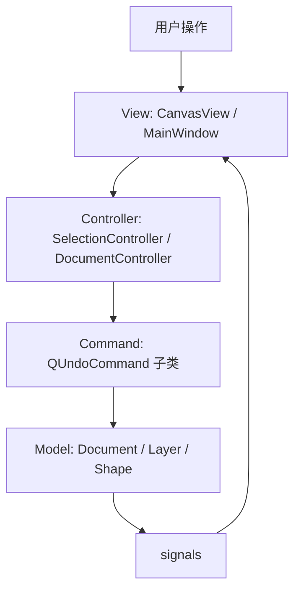

# VectorGenEditor 架构说明

> 本文档描述的是当前代码库的真实实现，而不是最初的空架构设想。
> 目标是帮助你快速理解项目如何启动、数据放在哪里、界面如何同步，以及主要功能从哪里进。

## 1. 项目定位

VectorGenEditor 是一个基于 **C++17 + Qt 5.15.2 Widgets** 的参数化矢量图形生成与编辑器。

当前实现采用的是 **Model-View-Command** 风格的 MVC 变体：

核心原则只有一句话：**Document 是唯一数据源**。`QGraphicsScene` 负责显示和交互，但不保存业务真相。

## 2. 启动流程

程序入口在 [src/main.cpp](../src/main.cpp)。启动顺序大致如下：

1. 创建 `Application`
2. 创建 `Document`
3. 创建 `CanvasScene`
4. 创建 `DocumentController`
5. 把 `Document` 和 `Controller` 注入到 `CanvasScene`
6. 进入主事件循环

这意味着项目的“中枢”不是某个全局单例，而是 `Document + DocumentController + CanvasScene` 这组三件套。

## 3. 目录职责

### 3.1 `src/model`

模型层负责保存所有真实数据。

- [Document](../src/model/Document.h) 管理图层、画板范围和文档级序列化
- [Layer](../src/model/Layer.h) 管理图层名称、可见性和图形顺序
- [Shape](../src/model/Shape.h) 是所有图形的基类
- [RectShape](../src/model/RectShape.h)、[EllipseShape](../src/model/EllipseShape.h)、[LineShape](../src/model/LineShape.h)、[PolylineShape](../src/model/PolylineShape.h)、[PolygonShape](../src/model/PolygonShape.h)、[StarShape](../src/model/StarShape.h)、[ArrowShape](../src/model/ArrowShape.h)、[TextShape](../src/model/TextShape.h) 是具体图形实现
- [Geometry](../src/model/Geometry.h) 和 [Workspace](../src/model/Workspace.h) 提供几何计算、边界判断、工作区约束
- [Artboard](../src/model/Artboard.h) 代表白色画板的共享矩形范围
- [ShapeFactory](../src/model/ShapeFactory.h) 负责按类型创建形状

### 3.2 `src/view`

视图层负责画布显示、工具栏、属性面板和交互反馈。

- [MainWindow](../src/view/MainWindow.h) 负责菜单、工具栏、状态栏和整体布局
- [CanvasView](../src/view/CanvasView.h) 负责缩放、平移、框选、线段预览、文本落点等交互
- [CanvasScene](../src/view/CanvasScene.h) 负责把模型同步成可视化 item
- [ShapeGraphicsItem](../src/view/ShapeGraphicsItem.h) 表示单个图形在场景中的显示对象
- [HandleItem](../src/view/HandleItem.h) 负责缩放/旋转手柄
- [PropertyPanel](../src/view/PropertyPanel.h)、[GenerationPanel](../src/view/GenerationPanel.h)、[LayerPanel](../src/view/LayerPanel.h) 负责右侧属性区
- [ToolPalette](../src/view/ToolPalette.h) 负责左侧工具选择
- [UiStyles](../src/view/UiStyles.h) 负责统一样式

### 3.3 `src/controller`

控制器层负责把用户行为翻译成模型变更。

- [DocumentController](../src/controller/DocumentController.h) 是最重要的业务控制器，负责创建、删除、复制、粘贴、移动、修改样式等操作
- [SelectionController](../src/controller/SelectionController.h) 负责选中状态、多选、框选、手柄管理和拖拽同步

### 3.4 `src/command`

命令层负责撤销 / 重做。

当前已有的命令包括：

- `AddShapeCommand`
- `RemoveShapeCommand`
- `MoveShapeCommand`
- `MoveShapesCommand`
- `ResizeShapeCommand`
- `RotateShapeCommand`
- `ModifyShapeCommand`
- `ChangeStyleCommand`
- `ChangeTextCommand`

这些命令配合 `QUndoStack` 使用，保证图形编辑操作可回退。

### 3.5 `src/serialization`

序列化层负责项目文件和 SVG 导出。

- [JsonSerializer](../src/serialization/JsonSerializer.h) 负责项目数据保存 / 读取
- [SvgExporter](../src/serialization/SvgExporter.h) 负责结构化 SVG 导出

### 3.6 `src/app`

- [Application](../src/app/Application.h) 封装 Qt 应用初始化和主入口运行

## 4. 核心数据模型

### 4.1 Document

[Document](../src/model/Document.h) 是整份文档的真实数据容器。

它负责：

- 管理多个图层
- 管理当前图层索引
- 管理画板 / 工作区矩形
- 提供按 id 查找图形、增删图形、移动层级等接口
- 发出 `documentChanged`、`shapeAdded`、`shapeRemoved`、`shapeChanged`、`layerChanged` 等信号

### 4.2 Layer

[Layer](../src/model/Layer.h) 是图形的组织单元。

它负责：

- 图层名称
- 图层可见性
- 图形列表和 z-order
- 图层级序列化

### 4.3 Shape

[Shape](../src/model/Shape.h) 是所有图形的抽象基类。

它包含两类核心信息：

- `Transform`：位置、宽高、旋转
- `Style`：填充色、描边色、线宽、可见性、线型

不同图形通过继承 `Shape` 实现自己的几何和序列化逻辑。

## 5. 交互与事件流

### 5.1 选择与框选

选择逻辑主要由 `CanvasView + SelectionController` 共同完成。

常见流程是：

1. 用户在 `CanvasView` 中单击或拖拽
2. 视图判断当前工具是选择、直线还是文本
3. 如果是选择工具，则把命中结果交给 `SelectionController`
4. `SelectionController` 维护选中集合并更新手柄
5. 场景 item 的选中状态和模型选择状态保持同步

### 5.2 图形创建

图形创建统一由 `DocumentController` 进入。

例如：

- `createRect`
- `createEllipse`
- `createTriangle`
- `createRegularPolygon`
- `createPolyline`
- `createLine`
- `createText`
- `createStar`
- `createArrow`

这些接口最终会通过命令修改 `Document`，而不是直接改视图。

### 5.3 属性修改

属性面板修改内容后，不应该直接改 `QGraphicsItem` 作为最终真相，而应由控制器生成对应命令，例如：

- 位置变化：`updateShapePosition` / `updateShapesPosition`
- 几何变化：`updateShapeGeometry`
- 旋转变化：`updateShapeRotation`
- 样式变化：`updateShapeStyle`
- 文本变化：`updateShapeText`

这样撤销 / 重做才是完整的。

## 6. 画布与画板逻辑

当前项目已经把“无限画布”和“白色画板”拆开了，但它们有明确关系：

- 灰色区域是可滚动 / 可扩展的场景背景
- 白色区域是画板（Artboard / Page）
- `Document::workspaceRect()` 保存画板范围
- `Artboard::rect()` 作为共享画板矩形的入口
- `Workspace` 负责页面边界、场景边界和裁剪判断

这套设计的好处是：

1. 画布仍然可以扩展
2. 导出时可以明确以画板为边界
3. 图形放在画板外不会破坏编辑，但可以按规则决定是否导出

## 7. SVG 导出

[SvgExporter](../src/serialization/SvgExporter.h) 当前采用结构化导出，不依赖 `scene->render()`。

导出策略可以概括为：

- 以文档的画板矩形作为 `viewBox`
- 每个图形导出为独立 SVG 元素
- 仅导出可见图层和可见图形
- 使用 `clipPath` 限制画板外内容
- 对与画板不相交的对象直接跳过

这意味着导出的 SVG 更接近“可编辑矢量源文件”，而不是一张截图。

## 8. 适合新手的阅读顺序

如果你是第一次看这个项目，建议按下面顺序学：

1. 先看 [src/main.cpp](../src/main.cpp)，理解启动链路
2. 再看 [src/model/Document.h](../src/model/Document.h)，理解数据放哪
3. 再看 [src/model/Shape.h](../src/model/Shape.h) 和几个具体 Shape，理解图形如何表达
4. 再看 [src/controller/DocumentController.h](../src/controller/DocumentController.h)，理解“操作怎么变成命令”
5. 再看 [src/controller/SelectionController.h](../src/controller/SelectionController.h)，理解多选、手柄和拖拽
6. 再看 [src/view/CanvasView.h](../src/view/CanvasView.h) 与 [src/view/CanvasScene.h](../src/view/CanvasScene.h)，理解鼠标事件如何进到系统里
7. 最后看 [src/serialization/SvgExporter.h](../src/serialization/SvgExporter.h)，理解导出逻辑

## 9. 当前实现的价值观

这个项目当前最重要的设计选择有三个：

1. **数据和视图分离**，不要把业务数据绑死在 `QGraphicsItem`
2. **所有可撤销操作都走命令**，这样编辑器才像编辑器
3. **SVG 导出要结构化**，不要把最终结果当截图处理

如果后续继续扩展，最值得保持的也是这三条。
